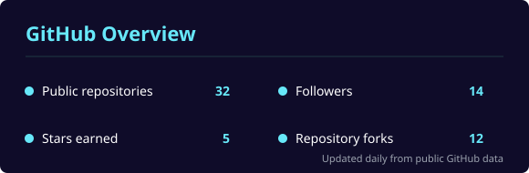

### Building trustworthy AI for better healthcare

MSc Information Technology candidate and Graduate Assistant at Strathmore University, Nairobi.

## About me

I work at the intersection of **healthcare, machine learning, and explainable AI**. My MSc research explores automated diabetic-retinopathy grading from retinal fundus images—and, crucially, how to make those predictions understandable and useful to clinicians.

Alongside my research, I support undergraduate software-engineering education, build full-stack applications, and automate academic workflows.

- 🔬 Researching deep learning and XAI for diabetic-retinopathy screening
- 🧑🏾‍🏫 Teaching software engineering and the software development lifecycle
- 🏥 Interested in practical, responsible AI for resource-constrained health systems
- 🌍 Based in Nairobi, Kenya

## Current research

### Explainable diabetic-retinopathy detection

| Focus | What I am working on |
|:--|:--|
| **Clinical problem** | Earlier screening for a leading cause of preventable blindness |
| **Machine learning** | CNN-based grading of retinal fundus images |
| **Explainability** | Grad-CAM, LIME, and SHAP for interpretable predictions |
| **Outcome** | A trustworthy e-health tool designed for under-resourced settings |

## Tools I work with

**AI & data**

**Applications & platforms**

## GitHub at a glance

  
  

> These cards are generated daily inside this repository, avoiding the shared public stats service and its rate limits. Language percentages reflect repository code, not proficiency.

## Let’s collaborate

I’m happy to connect about **e-health**, **explainable AI**, **research collaboration**, **software-engineering education**, and **technology for social impact in Africa**.

[Connect on LinkedIn](https://www.linkedin.com/in/aicha-myriam-mbongo-zindamoyen) · [Send me an email](mailto:azindamoyen@strathmore.edu)

Bridging AI and healthcare · Building solutions that matter · Teaching the next generation of engineers

